# Toolkits com pacotes do npm
## Funcionalidades
- gerar qrcode
- gerar senha aleatória
- converter texto para base64 e vice-versa

## Pacotes utilizados
- `prompt`
    - pacote que oferece recursos como input de usuário
    - www.npmjs.com/package/prompt
- `chalk`
    - pacote que permite estilizar  caracteres no terminal como cores de letras e fundos coloridos
    - https://www.npmjs.com/package/chalk
- `qrcode-terminal`
    - pacote que permite gerar qrcodes
    - www.npmjs.com/package/qrcode-terminal
- `js-base64`
    - pacote que permite converter string para base64 e vice-versa
    - www.npmjs.com/package/js-base64

## Arquitetura
